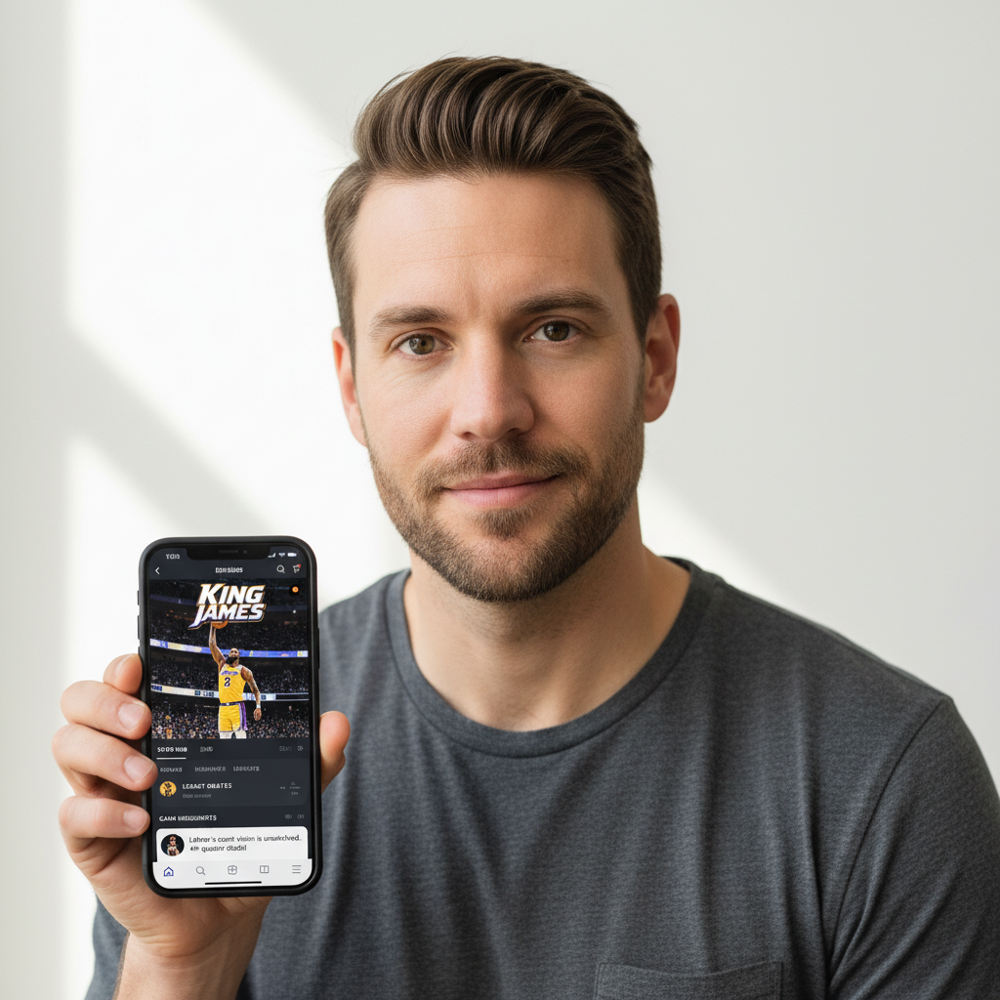
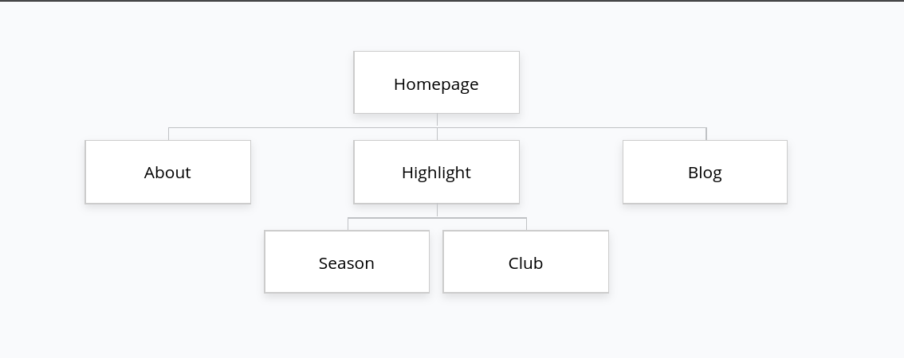
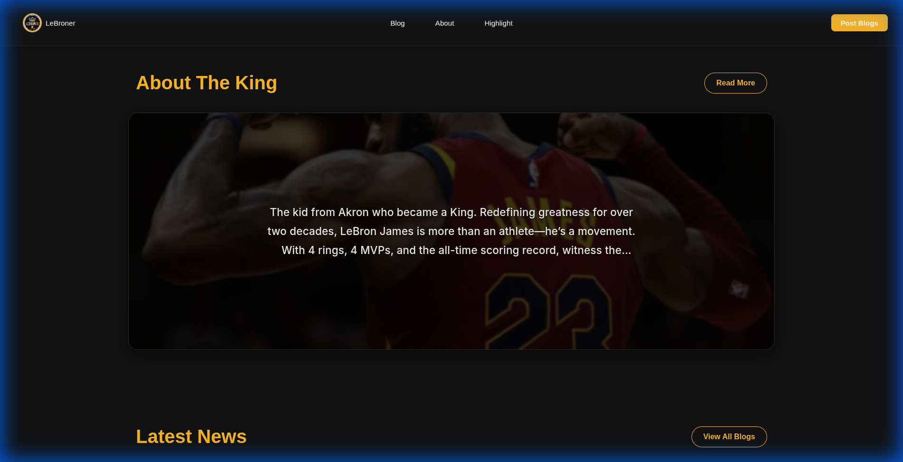
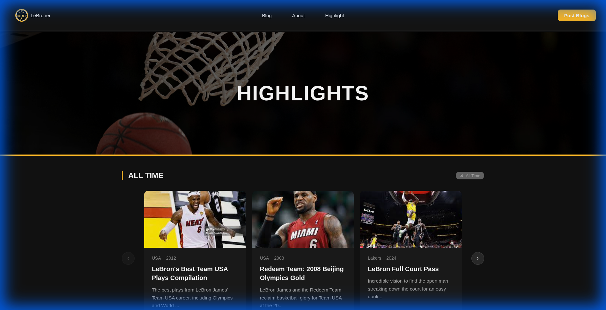
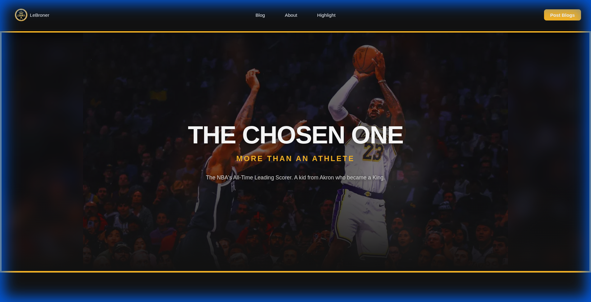
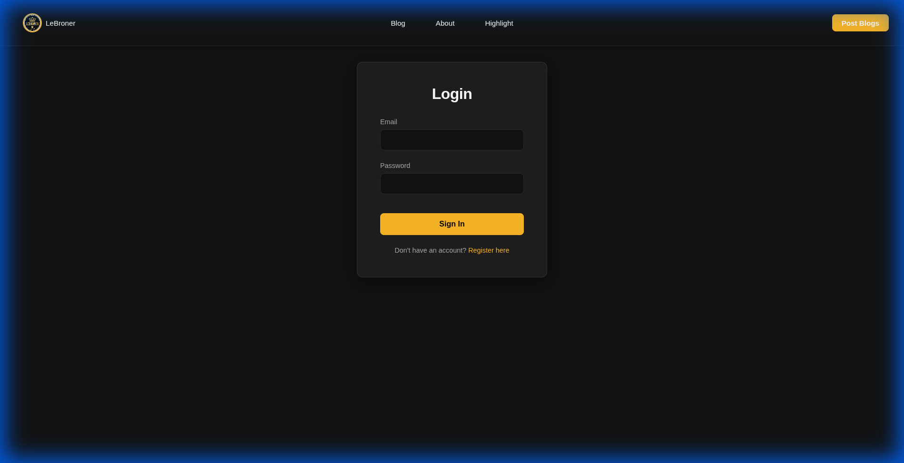
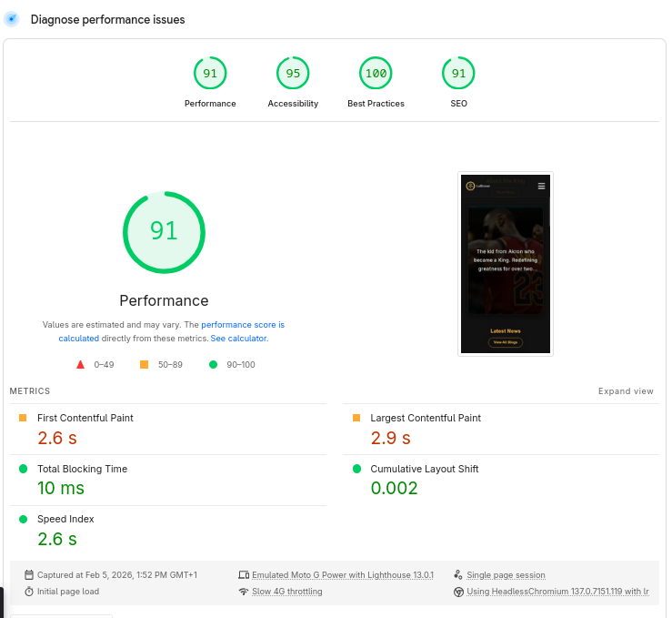
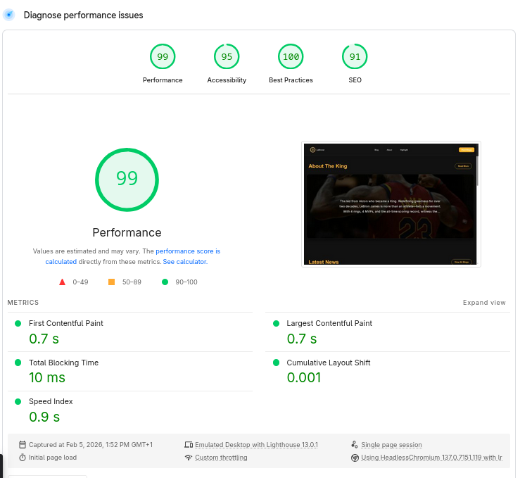

# Final Report

**Student:** Luka Žuljević  
**App:** https://lebroner.vercel.app/  
**Repository:** https://github.com/lukazuljevic/HCI-app-fesb

---

## 1. Project Idea

The main idea behind **Lebroner** is to create a centralized, beautifully designed fan platform for LeBron James.
Basketball fans around the world admire greatness, yet there isn’t one simple platform where people can watch legendary highlights, explore records, and learn more about LeBron's journey on and off the court.
**Lebroner** aims to become the go-to fan hub - celebrating LeBron’s impact on basketball, culture, and history.

---

## 2. The Problem

Currently, information about LeBron James is scattered across various platforms:

- Highlights are on YouTube or social media.
- Stats are on specialized sports databases.
- Biographical info is on Wikipedia or news sites.

This fragmentation makes it difficult for fans to get a complete picture of his legacy in one place.
**Lebroner** solves this by offering a unified space to relive iconic moments and browse career achievements.

---

## 3. Target Users

### Primary Users

- **Hardcore Fans:** People who want to revisit greatest moments.
- **Basketball Enthusiasts:** Users who love stats and records.
- **New Fans:** People discovering basketball and LeBron's legacy.

---

## 4. Proposed Solution

**Lebroner** is a modern, interactive web application that allows users to:

- Watch curated video highlights.
- Browse detailed career records and statistics.
- Learn about LeBron's life and philanthropic work.
- Engage with the content via a blog system.

### Key Features

- **Highlight Gallery:** Watch the greatest plays from high school to the NBA.
- **Record Gallery:** Season-by-season and all-time career statistics.
- **Info Section:** Biography and off-court impact.
- **Blog System:** Community updates and articles.
- **Admin Panel:** Content management for blogs and highlights.

---

## 5. User Personas

### John Doe

- **Age:** 16
- **Location:** USA
- **Occupation:** Student
- **Goals:** Wants a simple phone web app to watch highlights.
- **Traits:** Sporty, athletic.

### Kevin Smith

- **Age:** 22
- **Location:** USA
- **Occupation:** CS Junior Engineer
- **Goals:** Wants a desktop app with statistics section.
- **Traits:** Simple, smart, curious.

### Ante Antić

- **Age:** 40
- **Location:** Croatia
- **Occupation:** Store Owner
- **Goals:** Wants an easy-to-use web app.
- **Traits:** Decisive, analytical, passionate.

---

## 6. Information Architecture

### App Structure

- **Home:** Entry point with introduction and latest content.
- **Highlights:** Gallery of video highlights.
- **Records (Stats):** Detailed statistics.
- **Blog:** Articles and news.
- **About:** Information about the platform and LeBron.
- **Admin:** Management interface for content.

---

## 7. Sitemap

The sitemap defines the navigation structure of the application.

---

## 8. Design and User Interface

The interface follows a modern, dark-themed design with gold and purple accents (Lakers colors), focusing on visual impact and usability.

### Home Page

The Home Page introduces the platform and features a dynamic layout.
 

### Highlights Page

A gallery of curated video highlights.
 

### About Page

Information about the project and mission.
 

### Login Page

Secure access for administrators to manage content.
 

---

## 9. HCI Principles Applied

### Usability

Simple navigation bar and intuitive layout ensure users can find content easily.

### Consistency

Consistent color scheme (Gold/Purple/Dark) and typography across all pages.

### Feedback

Interactive elements and hover states provide immediate feedback to users.

### Accessibility

High contrast text and clear hierarchy aid readability.

---

## 10. Heuristic Analysis

Two significant usability problems were identified and resolved through heuristic evaluation. The analysis below follows Nielsen's 10 Usability Heuristics.

---

### Problem 1 - Navigation Does Not Indicate Current Location

**Heuristic violated:** #1 - Visibility of System Status

**Description:**
The navigation bar displayed links to all main sections (Home, About, Blog, Highlights, Records) without any visual indicator of which page the user was currently viewing. Every link looked identical regardless of whether it was active or not, giving the user no feedback about their current position in the application.

**Why it matters:**
Nielsen's first heuristic states that the system should always keep users informed about what is going on through appropriate and timely feedback. Navigation is one of the most fundamental feedback mechanisms in a web app - if a user cannot instantly tell where they are, they lose orientation. This is especially important on a multi-page fan site where users may jump between Highlights, Blog, and Records frequently.

**Severity:** 3 / 4 - Major problem. Every page visit is affected. Users navigating the site have no spatial reference point.

**Solution implemented:**
The `NavClient` component was updated to use Next.js's `usePathname()` hook to detect the current route. A `linkClass()` helper function applies an `.activeLink` CSS class to the matching nav item. The active link is styled with Lakers gold (`#FDB927`) text and a gold underline indicator, providing clear, immediate visual feedback.

**Result:** Users can now instantly identify their current location within the application at a glance, restoring spatial orientation and improving overall navigation confidence.

---

### Problem 2 - Users Cannot Edit or Delete Their Own Blog Posts

**Heuristics violated:** #3 - User Control and Freedom / #5 - Error Prevention / #9 - Help Users Recognize, Diagnose, and Recover from Errors

**Description:**
Once a user published a blog post, there was no way to correct a typo, update outdated information, or remove the post entirely. Only administrators had delete access. Additionally, if a post was submitted with an invalid image URL, there was no recovery path - the broken image simply displayed the post title as a text fallback, which looked unprofessional and gave no indication of the failure.

**Why it matters:**
Heuristic #3 (User Control and Freedom) explicitly addresses "emergency exits" - users make mistakes and need to undo or correct them. Locking authors out of their own content violates this principle directly. Heuristic #5 (Error Prevention) is also relevant: without a character minimum, users could submit near-empty posts that make no sense to readers. Heuristic #9 requires the system to communicate errors in plain language and offer a recovery path - a broken image showing a post title as fallback provides no such information.

**Severity:** 4 / 4 - Major problem. Affects every registered user who creates content. Once a mistake is published there is no recourse, which actively discourages user engagement.

**Solution implemented:**

Three distinct fixes were applied:

1. **Edit and delete for post authors** - The API routes (`PUT /api/posts/[id]`, `DELETE /api/posts/[id]`) were updated to authorize both admins and the original post author. The `BlogModal` component was extended with an inline edit form (title, image URL, content) and a delete button, visible only to the post's author or an admin.

2. **Image fallback with visual placeholder** - A React `imgError` state with an `onError` handler was added to every post image. When an image fails to load, the broken `` is replaced with a styled dark-gradient placeholder containing a landscape SVG icon, communicating the absence of an image clearly without showing the post title as a fallback.

3. **Minimum content length** - A 30-character minimum was enforced both client-side (live character counter, disabled submit button) and server-side (Zod validation), preventing the submission of meaningless placeholder posts.

**Result:** Authors can now correct mistakes after publishing, delete their own posts if needed, and receive clear visual feedback when an image cannot be loaded. The content creation flow now meets basic error prevention and recovery standards.

---

## 11. Evaluation and Improvements

Potential future improvements:

- **Interactive Charts:** More advanced visualizations for statistics.
- **User accounts:** Allow fans to save favorite highlights.
- **Comment section:** Enable community discussion on blogs.

---

## 12. Technologies Used

- **Framework:** Next.js 16
- **Library:** React 19
- **Database:** PostgreSQL with Drizzle ORM
- **Styling:** Vanilla CSS (CSS Variables)
- **Deployment:** Vercel

---

## 13. Performance Testing

Performance testing was conducted using Google PageSpeed Insights to ensure optimal user experience across devices.

### Mobile Result

### Desktop Result

The application achieves high performance scores, ensuring fast load times and responsiveness.

---

## 14. Conclusion

**Lebroner** successfully creates a dedicated space for LeBron James fans, combining rich media content with detailed statistics in a modern web interface. It addresses the fragmentation of information and provides a unified, engaging experience for basketball enthusiasts.
